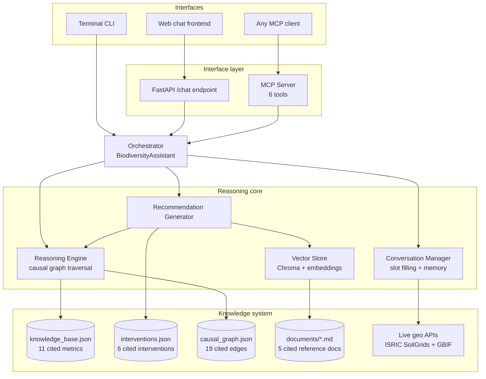

# Darukaa.Earth - Biodiversity Intelligence System

An AI environmental scientist, not a chatbot: a conversational system that reasons
across soil, climate, land use, and human impact metrics using a hand-curated,
cited knowledge graph, retrieves supporting evidence via RAG, and produces
quantified, evidence-backed recommendations - the exact output format the
challenge specifies.

Built for the Darukaa.Earth AI Engineer Internship (Climate-Tech & Nature
Intelligence) hackathon challenge.

## Why this isn't "just an LLM wrapper"

The brief is explicit that shallow, single-variable, LLM only answers will
score poorly. Three design choices exist specifically to avoid that:

1. **A hand-curated causal graph is the reasoning core, not the LLM.**
   `data/causal_graph.json` encodes ~19 directed, cited edges between 11
   environmental metrics (e.g. `soil_organic_carbon → microbial_diversity →
   species_richness`). Multi metric reasoning is literal graph traversal
   (`networkx`), so every "this affects that" claim in a recommendation can be
   walked back to a specific edge and its citation — not generated from a
   prompt.
2. **Recommendations are template-generated from a cited intervention
   catalog**, not free generated text. `data/interventions.json` has 6
   interventions, each with an applicability condition, mechanism, quantified
   primary/secondary effects, time horizon, confidence, and reference. This is
   what makes the output match the brief's own example ("Introduce
   legume-based cover crops → +15-25% SOC over 2-3 years, FAO") instead of
   the explicitly rejected "use sustainable practices."
3. **RAG retrieves supporting evidence on top of that**, so answers are
   grounded in retrievable text (`data/documents/*.md`), which is what the
   brief means by a "retrievable knowledge layer, not just prompts."

## Architecture



### RAG implementation detail worth knowing for review

The vector store (`src/knowledge/vector_store.py`) tries to load
`sentence-transformers` (`all-MiniLM-L6-v2`) for real semantic embeddings, and
**automatically falls back to a TF-IDF vectorizer** (scikit-learn, zero
network dependency) if that model can't be downloaded — e.g. in an offline
grading sandbox or a CI runner without Hugging Face access. Either way,
storage and similarity search go through Chroma as a real vector database;
only the embedding function is swapped. This was a deliberate reliability
decision, not a shortcut — the system should be gradeable even without
internet access to a model hub.

## Repository layout

```
darukaa-biodiversity-ai/
├── data/
│   ├── knowledge_base.json      # metrics, thresholds, citations
│   ├── interventions.json       # intervention catalog
│   ├── causal_graph.json        # causal edges
│   └── documents/*.md           # RAG corpus
├── src/
│   ├── knowledge/                # loading, vector store, geo enrichment
│   ├── reasoning/                 # causal graph + multi-metric engine
│   ├── recommendation/            # evidence-backed recommendation generator
│   ├── conversation/               # slot filling + session memory
│   ├── mcp_server/                 # MCP tool server (6 tools)
│   ├── api/                        # FastAPI demo backend
│   ├── orchestrator.py             # shared entry point for all interfaces
│   └── cli.py                      # terminal interface
├── frontend/index.html            # chat UI served by FastAPI
├── tests/                          # pytest suite (12 tests)
├── .github/workflows/ci.yml       # GitHub Actions: install, lint, test, smoke-test
└── requirements.txt
```

## Local setup

```bash
git clone <this-repo-url>
cd darukaa-biodiversity-ai
python -m venv venv && source venv/bin/activate   # optional but recommended
pip install -r requirements.txt

# Run the test suite
PYTHONPATH=. pytest tests/ -v

# Run the terminal interface
PYTHONPATH=. python -m src.cli

# Run the web demo (chat UI at http://localhost:8000)
PYTHONPATH=. uvicorn src.api.main:app --reload

# Run as an MCP server (for Claude Desktop or any MCP client)
PYTHONPATH=. python -m src.mcp_server.server
```

No API keys or external credentials are required to run this end to end —
the geo-enrichment calls to SoilGrids/GBIF are optional and fail open.

## Database / schema

There is no relational database in this system by design: the knowledge
layer is version-controlled JSON (auditable via `git diff`, no migration
tooling needed for a hackathon scale knowledge base), and conversation state
is an in-memory session store (`src/conversation/session.py`,
`SessionStore`) keyed by `session_id`. `SessionStore` is written as a thin
interface specifically so it can be swapped for Redis or SQLite in a
production deployment without touching any calling code - see
`src/orchestrator.py`, which only ever calls `sessions.get_or_create(...)`.

## CI/CD

`.github/workflows/ci.yml` runs on every push/PR to `main`:
1. Installs dependencies
2. Compiles every source file (fast syntax/import check)
3. Runs the full pytest suite
4. Boots the FastAPI app and hits `/health` as a smoke test

## Author

Varad Bhanap
