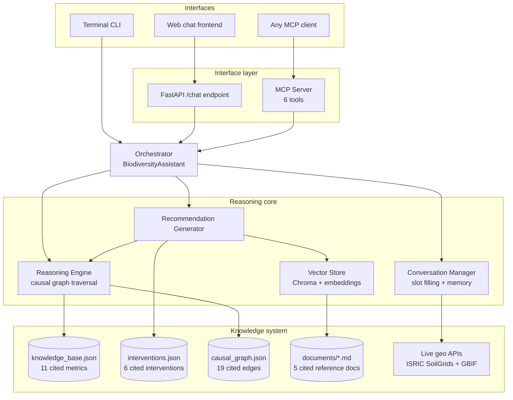

# Darukaa.Earth — Biodiversity Intelligence System

An AI environmental scientist, not a chatbot: a conversational system that reasons
across soil, climate, land use, and human-impact metrics using a hand-curated,
cited knowledge graph, retrieves supporting evidence via RAG, and produces
quantified, evidence-backed recommendations — the exact output format the
challenge specifies.

Built for the Darukaa.Earth AI Engineer Internship (Climate-Tech & Nature
Intelligence) hackathon challenge.

## Why this isn't "just an LLM wrapper"

The brief is explicit that shallow, single-variable, LLM-only answers will
score poorly. Three design choices exist specifically to avoid that:

1. **A hand-curated causal graph is the reasoning core, not the LLM.**
   `data/causal_graph.json` encodes ~19 directed, cited edges between 11
   environmental metrics (e.g. `soil_organic_carbon → microbial_diversity →
   species_richness`). Multi-metric reasoning is literal graph traversal
   (`networkx`), so every "this affects that" claim in a recommendation can be
   walked back to a specific edge and its citation — not generated from a
   prompt.
2. **Recommendations are template-generated from a cited intervention
   catalog**, not free-generated text. `data/interventions.json` has 6
   interventions, each with an applicability condition, mechanism, quantified
   primary/secondary effects, time horizon, confidence, and reference. This is
   what makes the output match the brief's own example ("Introduce
   legume-based cover crops → +15-25% SOC over 2-3 years, FAO") instead of
   the explicitly rejected "use sustainable practices."
3. **RAG retrieves supporting evidence on top of that**, so answers are
   grounded in retrievable text (`data/documents/*.md`), which is what the
   brief means by a "retrievable knowledge layer, not just prompts."

## Architecture



This mirrors the pattern used in [EIOS](https://github.com/varadbhanap/EIOS)
(MCP server + shared reasoning core + multiple client interfaces), applied
here to environmental reasoning instead of financial/credit-risk analytics.

### Request flow for the brief's own example

Input: `SOC 0.3%, rainfall low, monoculture wheat, semi-arid`

1. **Conversation manager** extracts `soil_organic_carbon=0.3`,
   `rainfall=low`, `land_use_type=monoculture` from text or accepts them as
   structured JSON directly.
2. **Reasoning engine** checks each metric against its threshold in
   `knowledge_base.json` → `soil_organic_carbon=0.3` is below
   `critical_low=0.5` → flagged `critical`. It then walks the causal graph
   from `soil_organic_carbon` outward and finds it reaches
   `microbial_diversity` (1 hop) and `species_richness` (2 hops).
3. **Recommendation generator** filters `interventions.json` for entries
   whose `applicable_when` matches the observed state (`soil_organic_carbon
   <= 1.0` and `land_use_type` in `[monoculture, intercropping]`), ranks them
   by how many limiting metrics they address, and returns them with the
   causal path attached.
4. **Vector store** is queried with the intervention name to retrieve
   supporting passages from `data/documents/` for additional grounding.
5. Output includes: recommendation, why it works, impacted metrics, primary
   + secondary quantified effects, time horizon, confidence, and citation —
   every field the brief's "Output Quality" section requires.

## Knowledge system design

| Layer | File | Contents |
|---|---|---|
| Structured metrics | `data/knowledge_base.json` | 11 metrics across soil, climate, land use, biodiversity, human impact — thresholds, units, what each affects, citation |
| Interventions | `data/interventions.json` | 6 interventions with trigger conditions, mechanism, quantified effects, time horizon, confidence, citation |
| Causal graph | `data/causal_graph.json` | 19 directed, cited edges connecting metrics — the multi-metric reasoning substrate |
| RAG corpus | `data/documents/*.md` | 5 short reference documents synthesized from cited literature (FAO, IPCC, IPBES, CBD, peer-reviewed meta-analyses), chunked and embedded for retrieval |
| Live geo enrichment | `src/knowledge/geo_data.py` | Real API calls to ISRIC SoilGrids (soil organic carbon, pH by coordinate) and GBIF (species occurrence counts near a coordinate), with graceful fallback to manual input if unreachable |

**This is intentionally a hand-curated knowledge base rather than a scraped
dataset.** Every number in it traces to a named, real source. That
traceability is what "clarity of knowledge retrieval pipeline" is asking for
— it's a defensible design choice to discuss in interview, not a shortcut.

### RAG implementation detail worth knowing for review

The vector store (`src/knowledge/vector_store.py`) tries to load
`sentence-transformers` (`all-MiniLM-L6-v2`) for real semantic embeddings, and
**automatically falls back to a TF-IDF vectorizer** (scikit-learn, zero
network dependency) if that model can't be downloaded — e.g. in an offline
grading sandbox or a CI runner without Hugging Face access. Either way,
storage and similarity search go through Chroma as a real vector database;
only the embedding function is swapped. This was a deliberate reliability
decision, not a shortcut — the system should be gradeable even without
internet access to a model hub.

## Repository layout

```
darukaa-biodiversity-ai/
├── data/
│   ├── knowledge_base.json      # metrics, thresholds, citations
│   ├── interventions.json       # intervention catalog
│   ├── causal_graph.json        # causal edges
│   └── documents/*.md           # RAG corpus
├── src/
│   ├── knowledge/                # loading, vector store, geo enrichment
│   ├── reasoning/                 # causal graph + multi-metric engine
│   ├── recommendation/            # evidence-backed recommendation generator
│   ├── conversation/               # slot filling + session memory
│   ├── mcp_server/                 # MCP tool server (6 tools)
│   ├── api/                        # FastAPI demo backend
│   ├── orchestrator.py             # shared entry point for all interfaces
│   └── cli.py                      # terminal interface
├── frontend/index.html            # chat UI served by FastAPI
├── tests/                          # pytest suite (12 tests)
├── .github/workflows/ci.yml       # GitHub Actions: install, lint, test, smoke-test
└── requirements.txt
```

## Local setup

```bash
git clone <this-repo-url>
cd darukaa-biodiversity-ai
python -m venv venv && source venv/bin/activate   # optional but recommended
pip install -r requirements.txt

# Run the test suite
PYTHONPATH=. pytest tests/ -v

# Run the terminal interface
PYTHONPATH=. python -m src.cli

# Run the web demo (chat UI at http://localhost:8000)
PYTHONPATH=. uvicorn src.api.main:app --reload

# Run as an MCP server (for Claude Desktop or any MCP client)
PYTHONPATH=. python -m src.mcp_server.server
```

No API keys or external credentials are required to run this end to end —
the geo-enrichment calls to SoilGrids/GBIF are optional and fail open.

## Database / schema

There is no relational database in this system by design: the knowledge
layer is version-controlled JSON (auditable via `git diff`, no migration
tooling needed for a hackathon-scale knowledge base), and conversation state
is an in-memory session store (`src/conversation/session.py`,
`SessionStore`) keyed by `session_id`. `SessionStore` is written as a thin
interface specifically so it can be swapped for Redis or SQLite in a
production deployment without touching any calling code — see
`src/orchestrator.py`, which only ever calls `sessions.get_or_create(...)`.

## CI/CD

`.github/workflows/ci.yml` runs on every push/PR to `main`:
1. Installs dependencies
2. Compiles every source file (fast syntax/import check)
3. Runs the full pytest suite
4. Boots the FastAPI app and hits `/health` as a smoke test

## Example interaction

```
> Biodiversity is declining on my land
[assistant] What is the soil organic carbon percentage (SOC%) for this land?

> {"soil_organic_carbon": 0.3, "rainfall": "low", "land_use_type": "monoculture"}

{
  "limiting_metrics": [
    {"metric": "soil_organic_carbon", "value": 0.3, "severity": "critical", ...}
  ],
  "recommendations": [
    {
      "recommendation": "Introduce legume-based cover crops",
      "why_it_works": "Legumes fix atmospheric nitrogen and their root exudates
                        feed soil microbial communities...",
      "primary_effect": {"metric": "soil_organic_carbon", "estimate": "+15-25% over 2-3 years"},
      "secondary_effects": [{"metric": "microbial_diversity", "estimate": "..."}],
      "time_horizon": "medium_term",
      "confidence": "high",
      "reference": "FAO, Conservation Agriculture and Soil Carbon Sequestration Report (2017)"
    }
  ]
}
```

## Honest limitations and next steps

- The causal graph is small (19 edges) and hand-curated rather than learned
  from field data — appropriate for a hackathon timeline, and the JSON
  structure is designed to be extended (e.g. with structural equation
  modeling on real survey data) without changing the reasoning engine's code.
- Text-based slot extraction is regex/keyword-based for transparency and
  determinism; a production version would swap in an LLM-based extractor
  behind the same `ConversationSession` interface.
- Geo-enrichment currently reads two properties (SOC, pH) from SoilGrids and
  a coarse species-occurrence count from GBIF; a fuller integration would add
  land cover classification (e.g. from a remote-sensing API) as a third geo
  signal.

## Author

Varad Bhanap — final-year B.E. student, Artificial Intelligence & Data
Science, Ajeenkya DY Patil School of Engineering (SPPU, Pune). Built using
the same MCP-powered multi-agent architecture pattern as
[EIOS](https://github.com/varadbhanap/EIOS).
